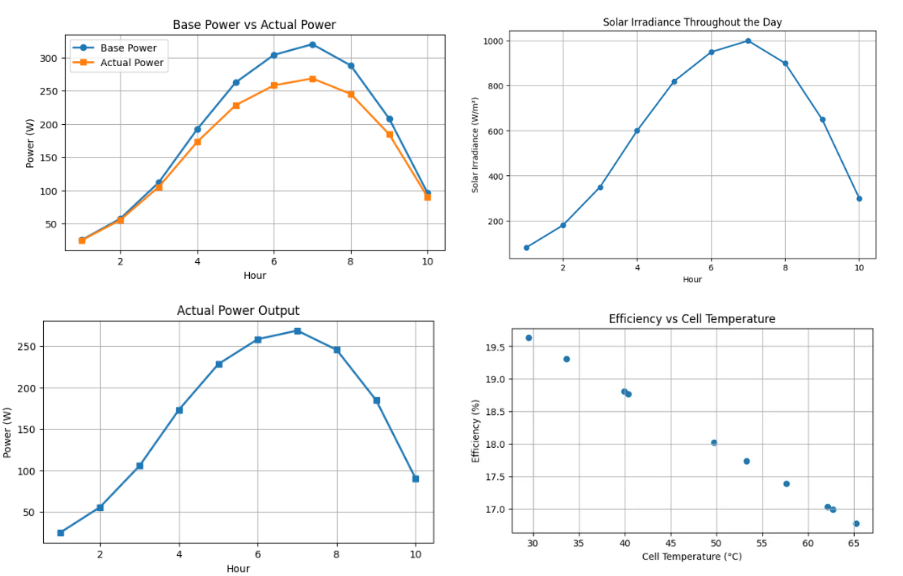

# Solar Photovoltaic Yield & Thermal Efficiency Calculator

## Overview

This project estimates photovoltaic (PV) energy generation while accounting for temperature-dependent efficiency losses using a thermal derating model.

The program takes solar irradiance and ambient temperature data, estimates solar cell temperature, calculates theoretical and actual power output, and visualizes system performance through engineering-focused plots.

---

## Features

- User-defined solar panel specifications
- Hourly solar irradiance and temperature analysis
- Cell temperature estimation using NOCT model
- Thermal derating calculations
- Power and energy generation calculations
- Performance visualization using Matplotlib
- Daily performance summary

---

## Technologies Used

- Python
- NumPy
- Pandas
- Matplotlib

---

## Engineering Concepts Used

### Cell Temperature Estimation

Cell temperature is estimated using:

Tcell = Tambient + ((NOCT - 20) / 800) × Irradiance

where:

- Tcell = Cell temperature (°C)
- Tambient = Ambient temperature (°C)
- NOCT = Nominal Operating Cell Temperature

### Thermal Derating

Power loss due to temperature is modeled using:

Derating Factor = 1 + γ × (Tcell - Tref)

where:

- γ = Temperature coefficient (-0.004 / °C)
- Tref = 25°C

### Actual Power Output

Actual Power = Base Power × Derating Factor

---
## Assumptions and Constants

| Constant | Symbol | Value |
|----------|---------|--------|
| Reference Temperature | Tref | 25 °C |
| Nominal Operating Cell Temperature | NOCT | 45 °C |
| Temperature Coefficient | γ | -0.004 / °C |

## Example Input

### Panel Specifications

| Parameter | Value |
|------------|--------|
| Panel Area | 1.6 m² |
| Panel Efficiency | 20 % |
| Duration | 1 hour |

### Environmental Data

| Hour | Ambient Temperature (°C) | Solar Irradiance (W/m²) |
|------|-------------------------:|------------------------:|
| 1 | 27 | 80 |
| 2 | 28 | 180 |
| 3 | 29 | 350 |
| 4 | 31 | 600 |
| 5 | 32 | 820 |
| 6 | 33 | 950 |
| 7 | 34 | 1000 |
| 8 | 34 | 900 |
| 9 | 33 | 650 |
| 10 | 31 | 300 

---

## Output Dashboard

---

## Sample Output

| Hour | Ambient Temp (°C) | Irradiance (W/m²) | Cell Temp (°C) | Actual Power (W) | Efficiency (%) |
|------|------------------:|------------------:|---------------:|-----------------:|---------------:|
| 1 | 27.0 | 80.0 | 29.50 | 25.14 | 19.64 |
| 2 | 28.0 | 180.0 | 33.62 | 55.61 | 19.31 |
| 3 | 29.0 | 350.0 | 39.94 | 105.31 | 18.81 |
| 4 | 31.0 | 600.0 | 49.75 | 172.99 | 18.02 |
| 5 | 32.0 | 820.0 | 57.62 | 228.16 | 17.39 |

*Values shown are representative output from the calculator.*

---

## Generated Visualizations

The project generates four engineering-focused visualizations:

1. Solar Irradiance vs Hour
2. Actual Power Output vs Hour
3. Base Power vs Actual Power
4. Efficiency vs Cell Temperature

These plots help visualize photovoltaic performance and temperature-related power losses.

---

## Future Improvements

- CSV weather data input
- Real-world weather station datasets
- Streamlit dashboard interface
- Monthly and yearly energy yield estimation
- PDF report generation
- Comparison of multiple solar panel configurations

---
